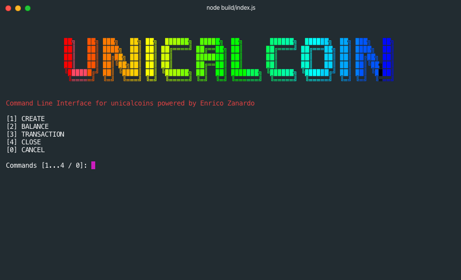

# Symbol CLI wallet 🎉

A Command Line Interface with mnemonic private key generator for the Symbol Blockchain provided by NEM. 🙌

This project is connected with the course provided on [Blockchain Course](https://blockchain-cryptocurrency.thinkific.com/)



You will find a step by step video course in how to build it on that course [link](https://blockchain-cryptocurrency.thinkific.com/)

If you want to test the app and receive some UnicalCoins 💰 just send [me](mailto:ezanardo@onezerobinary.com) an email with your ADDRESS ;)

### Mnemonic Private Key Generator

The following code show the builded function used to create a mnemonic private key starting from 4 random english words, hashing them like a mini markle tree and giving back a private key of 64 bit (sha256).

```ts
var mnGen = require('mngen');
import hasha from 'hasha';
var colors = require('colors/safe');

function sha256(word: string): string {
  return hasha(word, { algorithm: 'sha256', encoding: 'hex' });
}

export function generateMnemonicPrivateKey(): string {
  const mnemonic: string[] = mnGen.list(4); // [provide,crimson,float,carrot]

  console.log(
    `Write down those mnemonic worlds that are used to generate your private key:`
  );
  console.log(colors.yellow(`\n${mnemonic}`));

  let hashes: string[] = [];
  mnemonic.map((world) => {
    hashes.push(sha256(world));
  });

  // Pseudo Merkle Tree
  let tmp_result_1 = sha256(hashes[0] + hashes[1]);
  let tmp_result_2 = sha256(hashes[2] + hashes[3]);

  let privateKey = sha256(tmp_result_1 + tmp_result_2);

  return privateKey;
}
```

### Run the project:

#### 1. Clone the repo:

```
git clone https://github.com/onezerobinary/symbol-cli-wallet.git
```

#### 2. Install Dependencies

```
cd symbol-cli-wallet
```

```
yarn
```

#### 3. Compile the project

```
yarn build
```

#### 4. Run the Blockchain CLI UnicalCoin App

```
yarn start
```

Happy hacking! 🤙🏼
